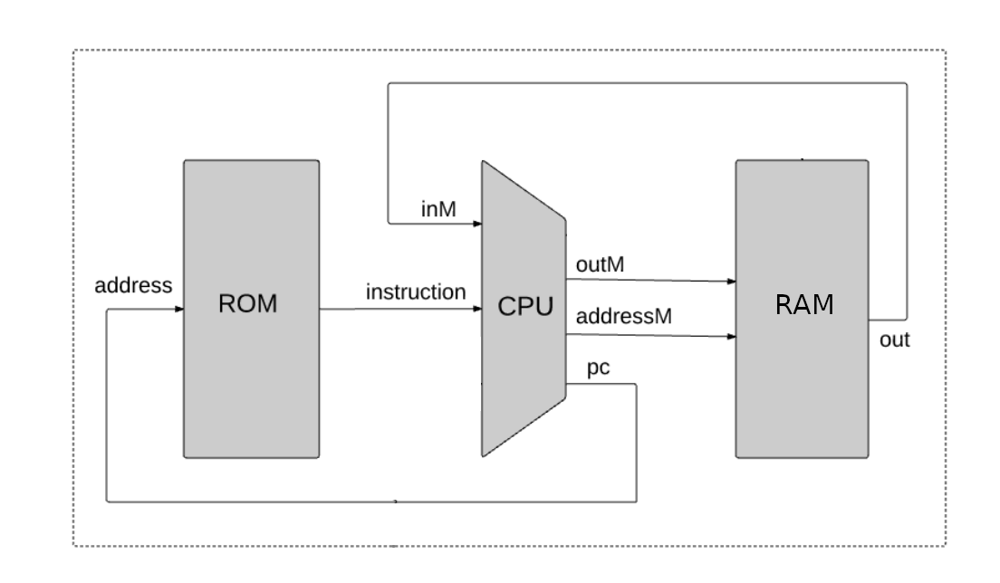
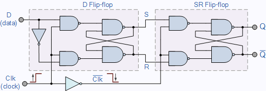

# nandirl
Real-life hardware implementation of the nand2tetris "Hack" computer architecture.

## Chapter 0: nand2tetris and the "Hack" computer architecture
Recently I've been obsessed with the Apollo spaceflight program, and of particular fascination to me is the Apollo Guidance Computer (AGC). There's a whole lot to say on the topic, but for the purposes of this introduction: I was reading one day that the logic circuits of the AGC are constructed entirely from NOR (Not OR) gates. What's a NOR gate? How could you make a computer out of them? What are logic circuits? That's when it hit me -- even though I've been programming them for over 20 years, *I have no idea how computers actually work in hardware*. I decided that I could no longer continue living in ignorance of a technology that so profoundly shapes our everyday lives. So I have endeavored to learn how computers work by constructing one from primitive logic gates, but instead of the NOR gates used on the AGC my computer will be made from NAND (Not AND) gates.

Starting out I obviously had no idea what goes into the design of such a computer, but luckily there are some wonderful and generous people out there who have gone out of their way to provide a comprehensive and free online course on the topic. The design I'll be using for my computer is based on the [nand2tetris](https://www.nand2tetris.org/) project that guides students through the architecture of a simple computer based on NAND gates, which the authors have named the "Hack" computer. If you're wondering what a NAND gate is, [this is a good place to start](https://logic.ly/lessons/nand-gate/). The lectures subsequently take students through the software implementation of Tetris for the Hack computer design. The course is awesome and I highly recommend it to anyone who wants to learn how computers work from the ground up. Given that the syllabus is focused on computer *design*, there is no actual hardware and instead the computer is constructed using software that simulates hardware. The instructors don't focus on how you would build this computer *in real life*, and I haven't been able to find anyone on the internet who has actually done it. Hence I've named my project **nandirl**.

The remainder of this chapter is a high-level overview of the computer architecture that may be helpful in understanding how all of the components will ultimately fit together. Check out the [nand2tetris](https://www.nand2tetris.org/) course for a better explanation (it assumes no previous technical training or computer knowledge). 

If we zoom out all the way, our computer consists of these three main components:
 

### ROM
ROM stands for "Read Only Memory". The ROM chip has a simple job in life -- given an *address*, the ROM provides an *instruction*. An address is simply a number, as is an instruction. Abstractly, imagine the ROM chip as a filing cabinet with many folders inside of it. The ROM chip gets an address, looks for the folder with the matching label, and hands back the contents of that folder (the instruction).

>More concretely, computers store numbers in *binary*. What's binary? The decimal number 5 in binary is **101**, because:
 **1**x2^2^ + **0**x2^1^ + **1**x2^0^ =  **1**x4 + **0**x2 + **1**x1 = 5. 
>
>Since we've used three powers of 2, this is a *3-bit *binary number. The more powers of two we use the more numbers we can represent with our computer. The Hack computer, and thus the nandirl computer, is a *16-bit architecture*. Thus the smallest (unsigned) number we can represent is **0000 0000 0000 0000**:
 **0**x2^15^ +**0**x2^14^ + **0**x2^13^ + **0**x2^12^+ **0**x2^11^ +**0**x2^10^ + **0**x2^9^ + **0**x2^8^+ **0**x2^7^ +**0**x2^6^ + **0**x2^5^ + **0**x2^4^+ **0**x2^3^ +**0**x2^2^ + **0**x2^1^ + **0**x2^0^ = 0
>
>and largest (unsigned) number our computer can represent is **1111 1111 1111 1111**:
 **1**x2^15^ +**1**x2^14^ + **1**x2^13^ + **1**x2^12^+ **1**x2^11^ +**1**x2^10^ + **1**x2^9^ + **1**x2^8^+ **1**x2^7^ +**1**x2^6^ + **1**x2^5^ + **1**x2^4^+ **1**x2^3^ +**1**x2^2^ + **1**x2^1^ + **1**x2^0^ = 65535
>
>As it turns out, we can also represent every number in between with the right combination of 16 **1**'s and **0**'s, i.e. by adding the right combination of powers of 2 between 2^0^ and 2^15^! 

Back to the ROM chip. The *address* passed into the ROM chip takes the form of 16 digital electrical signals, each at either a low voltage (representing a 0) or a high voltage (representing a 1). That corresponds to a 16-bit binary number, thus our ROM chip can store 65536 unique instructions! The *instruction* output, similarly, takes the form of 16 digital electrical signals. Each of those 16 individual instruction signals are going to tell the CPU what to do.

So to recap, ROM gets a 16-bit address. It finds that address in its filing cabinet and outputs the contents, which happens to be another set of 16 bits. Get a new address, look in a new memory location, send out a new instruction. In real life the 16 bits are represented as either high or low voltage (electrical potential) transmitted via 16 tiny metal wires going into the chip and 16 going out. It's called *read-only* memory because the contents of the memory does not change throughout the course of the computer's execution (it can only be *read*, not *written*). The 16-bits of instruction will go on to tell the CPU what to do, hence the ROM chip contains the *program* that the computer will execute. As a final note, ROM chips retain their memory even when the computer is powered off, so that the ROM will reliably provide the same addressed instruction data each and every time the computer is turned on.

### RAM
RAM stands for "Random Access Memory". It is very similar to ROM, in that it stores 16-bit numbers in filing cabinets that are indexed by 16-bit addresses. Get a 16-bit address, output the 16-bit number stored at that address. The thing that makes RAM different from ROM is that you can *write* a value to an address as well as *read* a value from an address. The chip uses to the same set of incoming address bits whether it's reading or writing. In order to know what value to write to memory, the RAM chip has 16-bits of data *input*. Hence there are two lines going into the RAM chip (*address* and *data input*) and one coming out (*data output*). 

In the computer architecture, the input *to* the RAM chip comes from the output of the CPU (hence it's labeled "outM" or "out to Memory" in the diagram). The output *from* the RAM chip goes...back into the CPU! This may seem odd, but the CPU is effectively using the RAM as short-term memory. The RAM doesn't store a program like ROM does -- in fact, all of the data stored in RAM resets to some unpredictable state every time the computer turns off. The RAM does, however, provide 65536 readable and writeable memory locations for the CPU to store and fetch 16-bit numbers during program execution. This comes in handy when the CPU does calculations and needs to store the result for use later on.

### CPU

In subsequent chapters I'll be building out each one of the major components in this architecture. A preview is below!

- Chapter 1: 1-bit Register
- Chapter 2: 16-bit Register
- Chapter 3: Program Counter
- Chapter 4: Read-only Memory (ROM)
- Chapter 5: Random Access Memory (RAM)
- Chapter 6: Arithmetic Logic Unit (ALU)
- Chapter 7: Clock Generator
- Chapter 8: Motherboard
- Chapter 9: Debugger
- Chapter 10: Getting the PCBs Fabricated
- Chapter 11: Assembling Components onto the PCBs
- Chapter 12: Testing the Components

## Chapter 1: 1-bit Register
One of the most basic things a computer needs to do is remember things, and it does this by storing "bits" i.e. 0's and 1's. One of the core components of a computer processor that performs this remembering function is called a "register". A 1-bit register has the ability to store 1-bit of information, i.e. it remembers whether it is currently a 0 or currently a 1. There are a few key details of a 1-bit register:

* **Input:** The register takes a digital input, which in the case of the nandirl computer is a 3.3V signal that is either low (0V-0.8V, representing a 0) or high (2.0V-3.3V, representing a 1).
* **Load:** The register does not always "listen" to its input. The Load signal (again, a digital 3.3V signal) tells the register whether to accept the input (Load=1) or ignore the input (Load=0) and retain its current value. The reason is that there will always be some signal on the input, but the computer may not always want a register to store that signal at the current instruction cycle.
* **Output:** The output signal (digital 3.3V signal) represents the current stored state of the register. It always outputs either low (0V) or high (3.3V) corresponding to its current stored value.
* **Clock:** Components in the computer that retain their internal state over time (like registers, which retain their "0" or "1" state) are termed "sequential logic" devices because they require a clock signal to synchronize discrete instants when something should happen. In the case of the register, there needs to be a distinct instant in time when the register updates it's new output (based on the Input and Load signals). The Clock input is the thing that signals this instant in time. Specifically, the clock signal is constantly pulsing from high to low to high to low (like a square wave), and the register uses the instant that the clock signal goes from high to low (the "falling edge") as its cue to update it's output signal based on the Input and Load signals. At all other times the output will not change, for reasons that will become clear later.

The nand2tetris course materials say very little about the actual hardware implementation of a register. The concept of a "Data Flip-flop" (or DFF) is given as a primitive building block without really saying how it works. Luckily, a DFF-based circuit that has a data input and updates its output on a clock signal edge can be implemented from NAND gates (with the help of the internet, of course). I based my DFF NAND implementation on [this helpful site](https://www.electronics-tutorials.ws/sequential/seq_4.html). The image below shows the implementation, a Data Flip-Flop followed by a Set-Reset Flip-Flop. The DFF is essentially the input stage, it is listening to the Data input when the clock is high. The instant the clock goes low the DFF stops listening to its input and a few nanoseconds later (the propagation delay from the Not gate on the clock input) the SRFF starts listening to its inputs, setting the overall output of the register. Hence the output updates itself precisely on the falling edge (the transition from high to low) of the clock signal.

Source: [https://www.electronics-tutorials.ws/sequential/seq_4.html](https://www.electronics-tutorials.ws/sequential/seq_4.html)

This doesn't take into account the Load input, which is achieved via the use of another basic circuit, the "Mux". The Mux has three inputs and one output:
A: A digital 3.3V signal that represents 1-bit input A
B: A digital 3.3V signal that represents 1-bit input B
Sel: A digital 3.3V signal that indicates whether the output should be A (Sel=0) or B (Sel=1)
Output: Digital 3.3V signal that is set to either A or B, depending on Sel

The Mux can also be implemented using three NAND gates, as shown in the circuit below. In the circuit, S is short for Sel, and S' means "not S", i.e. if S=0 then S'=1 and vice versa. To generate "not S", a 4th NAND gate is required to act as a "Not" gate, or a gate that simply inverts its own input. A Not gate can be made from a NAND gate by simply connecting the same input signal to both inputs of the NAND gate.

Putting the DFF-SR and Mux circuits together, we get the fully-functional 1-bit register. Below is the full *schematic* for the circuit. A circuit schematic effectively captures the design of the circuit using boxes and symbols to represent devices, and wires to represent the connections between device pins:

[Schematic]
You'll notice that the NAND gates come in groups of four, and that's because the integrated circuit I've chosen to base the whole computer on incorporates 4 NAND gates into one chip. The [SN74ALVC00](https://www.digikey.com/product-detail/en/texas-instruments/SN74ALVC00DR/296-5101-1-ND/373963) is a 3.3V device made by Texas Instruments. I chose it because it has 4 gates in one package (to keep overall circuit board size down), it can drive up to 50mA of output current, and it has a very low maximum propagation delay of 3 nanoseconds. Propagation delay is the amount of time it takes for the device to generate the correct output after its two inputs are set. Once the full computer is built out signals are going to have to make their way through a lot of these gates in series, so the lower the propagation delay the faster signals will move through the computer and, ultimately, the faster the computer will be.

In summary, a 1-bit register circuit takes 12 total NAND gates to implement (8 for the DFF-SR circuit, and 4 for the Mux), and can be encapsulated into this functional block:
[Heir circuit]

Here's a video showing a breadboard prototype of the circuit using larger DIP versions of the quad NAND chips. The Red LED is connected to the output, Green is Load, Yellow is Input, and Blue is Clock. You'll notice that the output doesn't change until the clock goes from On to Off (the falling edge). When this happens, the Output will either match the current Input (if Load is On), or it will keep its previous value (if Load is Off). FYI The little red switches that I'm using to set Input and Load are called "DIP switches". Having designed and prototyped a 1-bit register, the next chapter will put 16 of these together to form a 16-bit register, and go through the process of designing a printed circuit board (PCB) that can be custom manufactured!

## Chapter 2: 16-bit Register
The nand2tetris computer is a 16-bit architecture. That means that data is passed around, stored, and manipulated in groups of 16-bits. The first full component of the computer I decided to take on is the 16-bit Register. It is, quite simply, a board that contains 16 1-bit registers where each register has its own Input and Output signals, but the Load and Clock signals are shared between all of them.

## Chapter 3: Program Counter

## Chapter 4: Read-only Memory (ROM)

## Chapter 5: Random Access Memory (RAM)

## Chapter 6: Arithmetic Logic Unit (ALU)

## Chapter 7: Clock Generator

## Chapter 8: Motherboard

## Chapter 9: Debugger

## Chapter 10: Getting the PCBs Fabricated

## Chapter 11: Assembling Components onto the PCBs
