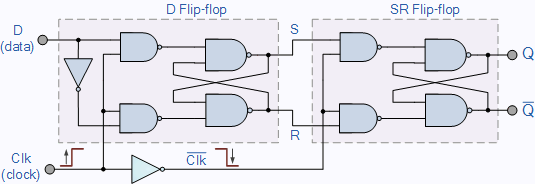
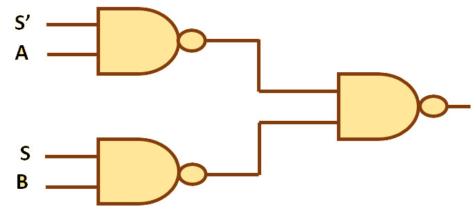

## Chapter 1: 1-bit Register
One of the most basic things a computer needs to do is remember things, and it does this by storing "bits" i.e. 0's and 1's. One of the core components of a computer processor that performs this remembering function is called a "register". A 1-bit register has the ability to store 1-bit of information, i.e. it remembers whether it is currently a 0 or currently a 1. There are a few key details of a 1-bit register:

* **Input:** The register takes a digital input, which in the case of the nandirl computer is a 3.3V signal that is either low (0V-0.8V, representing a 0) or high (2.0V-3.3V, representing a 1).
* **Load:** The register does not always "listen" to its input. The Load signal (again, a digital 3.3V signal) tells the register whether to accept the input (Load=1) or ignore the input (Load=0) and retain its current value. The reason is that there will always be some signal on the input, but the computer may not always want a register to store that signal at the current instruction cycle.
* **Output:** The output signal (digital 3.3V signal) represents the current stored state of the register. It always outputs either low (0V) or high (3.3V) corresponding to its current stored value.
* **Clock:** Components in the computer that retain their internal state over time (like registers, which retain their "0" or "1" state) are termed "sequential logic" devices because they require a clock signal to synchronize discrete instants when something should happen. In the case of the register, there needs to be a distinct instant in time when the register updates it's new output (based on the Input and Load signals). The Clock input is the thing that signals this instant in time. Specifically, the clock signal is constantly pulsing from high to low to high to low (like a square wave), and the register uses the instant that the clock signal goes from high to low (the "falling edge") as its cue to update it's output signal based on the Input and Load signals. At all other times the output will not change, for reasons that will become clear later.

The nand2tetris course materials say very little about the actual hardware implementation of a register. The concept of a "Data Flip-flop" (or DFF) is given as a primitive building block without really saying how it works. Luckily, a DFF-based circuit that has a data input and updates its output on a clock signal edge can be implemented from NAND gates (with the help of the internet, of course). I based my DFF NAND implementation on [this helpful site](https://www.electronics-tutorials.ws/sequential/seq_4.html). The image below shows the implementation, a Data Flip-Flop followed by a Set-Reset Flip-Flop. The DFF is essentially the input stage, it is listening to the Data input when the clock is high. The instant the clock goes low the DFF stops listening to its input and a few nanoseconds later (the propagation delay from the Not gate on the clock input) the SRFF starts listening to its inputs, setting the overall output of the register. Hence the output updates itself precisely on the falling edge (the transition from high to low) of the clock signal.

Source: [https://www.electronics-tutorials.ws/sequential/seq_4.html](https://www.electronics-tutorials.ws/sequential/seq_4.html)

This doesn't take into account the Load input, which is achieved via the use of another basic circuit, the "Mux". The Mux has three inputs and one output:
A: A digital 3.3V signal that represents 1-bit input A
B: A digital 3.3V signal that represents 1-bit input B
Sel: A digital 3.3V signal that indicates whether the output should be A (Sel=0) or B (Sel=1)
Output: Digital 3.3V signal that is set to either A or B, depending on Sel

The Mux can also be implemented using three NAND gates, as shown in the circuit below. In the circuit, S is short for Sel, and S' means "not S", i.e. if S=0 then S'=1 and vice versa. To generate "not S", a 4th NAND gate is required to act as a "Not" gate, or a gate that simply inverts its own input. A Not gate can be made from a NAND gate by simply connecting the same input signal to both inputs of the NAND gate.

Putting the DFF-SR and Mux circuits together, we get the fully-functional 1-bit register. Below is the full *schematic* for the circuit. A circuit schematic effectively captures the design of the circuit using boxes and symbols to represent devices, and wires to represent the connections between device pins:

[Schematic]
You'll notice that the NAND gates come in groups of four, and that's because the integrated circuit I've chosen to base the whole computer on incorporates 4 NAND gates into one chip. The [SN74ALVC00](https://www.digikey.com/product-detail/en/texas-instruments/SN74ALVC00DR/296-5101-1-ND/373963) is a 3.3V device made by Texas Instruments. I chose it because it has 4 gates in one package (to keep overall circuit board size down), it can drive up to 50mA of output current, and it has a very low maximum propagation delay of 3 nanoseconds. Propagation delay is the amount of time it takes for the device to generate the correct output after its two inputs are set. Once the full computer is built out signals are going to have to make their way through a lot of these gates in series, so the lower the propagation delay the faster signals will move through the computer and, ultimately, the faster the computer will be.

In summary, a 1-bit register circuit takes 12 total NAND gates to implement (8 for the DFF-SR circuit, and 4 for the Mux), and can be encapsulated into this functional block:
[Heir circuit]

Here's a video showing a breadboard prototype of the circuit using larger DIP versions of the quad NAND chips. The Red LED is connected to the output, Green is Load, Yellow is Input, and Blue is Clock. You'll notice that the output doesn't change until the clock goes from On to Off (the falling edge). When this happens, the Output will either match the current Input (if Load is On), or it will keep its previous value (if Load is Off). FYI The little red switches that I'm using to set Input and Load are called "DIP switches". Having designed and prototyped a 1-bit register, the next chapter will put 16 of these together to form a 16-bit register, and go through the process of designing a printed circuit board (PCB) that can be custom manufactured!